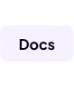

<a href="https://knight.metatable.dev"></a><a href="https://github.com/RAMPAGELLC/knight/releases"></a>
<hr>
Knight is a robust and modular Roblox game framework designed to help you organize your projects efficiently. It provides optional tools to enhance your workflow—but tools are **not required** to use Knight.

---

## 🚀 Getting Started

You can start using Knight in three ways:

### Option 1: Clone via Git

```bash
git clone https://github.com/RAMPAGELLC/knight.git
```

### Option 2: Using Wally

Add `knight = "vq9o/knight@1.0.5"` to `wally.toml` then run `wally install`.

### Option 3: Using Knight CLI

If you have Knight CLI installed:

```bash
knight init
```

### Option 4: Download RBXL Binary via GitHub releases

https://github.com/RAMPAGELLC/knight/releases

---

## 🛠 Tools (Optional)

These tools are **optional** and exist to improve your workflow with Knight.

### ✅ Knight VSC Extension

Create and autofill Knight services in VS Code.

-   [Marketplace](https://marketplace.visualstudio.com/items?itemName=MetaGames.vsc-knight)
-   [GitHub](https://github.com/RAMPAGELLC/vsc-knight)

---

### ✅ Knight CLI

Initialize and manage Knight projects via terminal.

-   [GitHub](https://github.com/RAMPAGELLC/KnightCLI)

```bash
npm install -g @rampagecorp/knight
knight -h
```

---

### ✅ KPM.client (Knight Package Manager v2)

Install and manage Knight packages.

-   [GitHub](https://github.com/RAMPAGELLC/kpm.client)
-   [Installer](https://github.com/RAMPAGELLC/kpm.client/releases/tag/installer-v1.0.1)

```bash
npm install -g kpm.client
kpm -h
```

---

### ✅ Knight Script Profiler (KSP)

Live script debugging for Knight framework services.

-   [Roblox Asset](https://create.roblox.com/store/asset/16837740534/Knight-Live-Script-Profiler)
-   [GitHub](https://github.com/RAMPAGELLC/KnightProfiler)

---

## 🧾 Deprecated Tools

### ❌ RAMPAGE CLI (RCLI)

Previously required for installing KPM modules.

-   [Roblox Asset](https://create.roblox.com/marketplace/asset/7232500201/RAMPAGE-CLI)

### ❌ Knight Services Manager (KSM)

Basic GUI for managing Knight services (early prototype).

-   [Roblox Asset](https://create.roblox.com/marketplace/asset/13168343690/Knight-Services-Manager)

### ❌ Knight Package Manager (KPM v1)

-   [GitHub](https://github.com/RAMPAGELLC/KnightPackageManager)

---

## 🤝 Contribute
We welcome contributions from everyone!
-   [Contribute to Documentation](https://knight.metatable.dev/contribution/documentation)
-   [Contribute to Framework](https://knight.metatable.dev/contribution/framework)

Simply make your edits in a Fork and open a PR!
---

## 📄 License
[MIT License](https://github.com/RAMPAGELLC/knight/blob/main/LICENSE)
